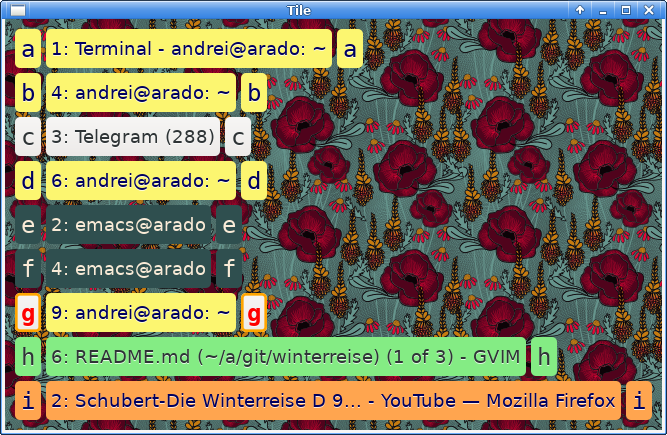

Description
===========

"Mouseless navigation". Keyboard navigation and window tiling for Linux desktop. 

`Winterreise` installs two programs, `wint` and `winj`.

The first program, `winj`, allows to use keyboard to switch between windows and workspaces. 
It shows a menu with the colored list of windows, marked by letters a-z. 
Colors are configurable. Pressing the key a-z "teleports" to that window. 
Pressing the space bar brings up the previous window. Pressing 1-9 "teleports" to the corresponding workspace. 

The second program, `wint`, allows to tile windows using predefined tiling schemes. 

I use patterns from [colourlovers.com](http://www.colourlovers.com/lover/albenaj) for the window background:

Installation
============

With Nix package manager
------------------------

    nix profile install github:amkhlv/winterreise

But also need to create a configuration:

    git clone https://github.com/amkhlv/winterreise
    cd winterreise
    mkdir  ~/.config/winterreise
    cp  config/*  ~/.config/winterreise/

This installs two programs: `winj` and `wint`.

On Debian
---------

Need to install [Cargo](https://www.rust-lang.org/tools/install), 
and some system libraries:

    sudo apt-get install build-essential libxcb-ewmh-dev libxcb-icccm4-dev x11-utils libgtk-3-dev libgdk-pixbuf-2.0-dev libatk1.0-dev libpango1.0-dev libcairo-dev libglib2.0-dev

then build and install:

    git clone https://github.com/amkhlv/winterreise
    cd winterreise
    cargo install --path .

Then copy config:

    mkdir  ~/.config/winterreise
    cp  config/*  ~/.config/winterreise/

The `cargo install` installs two programs: 

1. `wint` for tiling windows

2. `winj` for jumping between windows

They are installed into `~/.cargo/bin/` (which was added to `PATH` when `cargo` was installed).

Use
===

Window tiling
-------------

There is a tiling description file `~/.config/winterreise/tilings.xml`.
Each "geometry" is of the form `x,y,width,height` where `x,y` are the coordinates of the top left corner of the window.

Execution of the command `wint` brings up a dialog window containing:

1. A char-hinted list of windows on the current desktop

2. A command line at the bottom

In the command line, type the description of the desired layout. For example, if window charhinted `a` should be laid out as `tex`,
and window `c` as pdf, type:

    atex cpdf

and press `Enter`. (Notice that the charhint is followed immediately by the name of the tiling model defined in `tilings.xml`.)

Desktop navigation
------------------

Execute:

    winj -h

for help...

The colors of the buttons are determined by the `CSS` file `~/.config/winterreise/style.css`. 
The style classes listed in that file follow the pattern: `wbtn_CLASSNAME`. 
If `CLASSNAME` contains a dot, replace it with underscore:

    org.inkscape.Inkscape -> wbtn_org_inkscape_Inkscape

### How to learn the `CLASSNAME` of an application

Run the command:

    xprop WM_CLASS

The mouse cursor will become a cross. Click on the window in question.
The output will be something like:

    WM_CLASS(STRING) = "xterm", "UXTerm"

Notice that there are two values: "xterm" and "UXTerm"
The first one, "xterm", is called `res_name` , while the second ("UXTerm") is called `res_class`.
(Together they form a struct `XClassHint` of the `xlib` library.) 

Our `winj` looks at `res_name`. It ignores `res_class`.

### Using xdotool to set WM_CLASS of a window

The `res_name` of  a window is typically hard-coded in the application, and
sometimes it is desirable to change it.

A program called `xdotool` allows to change the `res_name` of any window. It is done
in two steps. The first step is to execute:

    xdotool  search --pid   $WINDOW_PID

where `$WINDOW_PID` is the process ID of the process which owns the window.
The result will be a window code (or a list of codes, if there are several windows). 
Let us call it `$WINDOW_CODE`. Then second step is to execute:

    xdotool  set_window --classname NEWNAME  $WINDOW_CODE

where `NEWNAME` is the `res_name` we want.

Configuring keyboard shortcuts with `xbindkeys`
===============================================

These lines in `~/.xbindkeysrc` :

    #winj
    "winj >>/tmp/winterreise.log 2>&1"
        m:0x40 + c:45
        Mod4 + k
    
    #winj-current
    "winj -c >>/tmp/winterreise.log 2>&1"
        m:0x40 + c:44
        Mod4 + j
    
    #tile
    "wint"
        m:0x40 + c:28
        Mod4 + t

confugure keyboard shortcuts: `Super+k` and `Super+j` for `winj`, and `Super+t` for `wint`.

